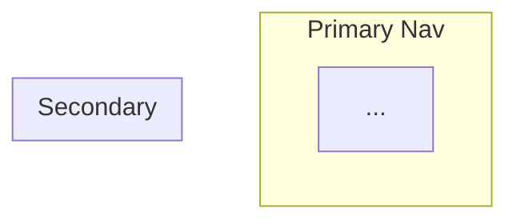

# Content Architect

Design what goes where. Every screen has one job, every journey has a destination, every piece of content lives in exactly one place.

## Routing

Use this skill for:

- Sitemap, page map, navigation structure, IA/content hierarchy.
- Screen inventory: what pages/screens exist, their jobs, and how they connect.
- CLI-to-frontend mapping: which commands deserve UI screens.
- Redesign planning where the first decision is which screens survive.

Do not use this skill for:

- Building or styling UI. Use frontend/design skills instead.
- Visual identity, color, typography, tokens, or design systems.
- Full PRDs, implementation tickets, or issue breakdowns.
- Code architecture, module design, or refactoring.

## Modes

Default to `quick` unless the user explicitly asks for a full blueprint, workshop, or staged validation.

- `quick`: ask only for missing high-impact context. If enough context is present, state assumptions and produce a direct recommendation with the minimum useful screen/nav structure. Do not pause at gates.
- `full workshop`: use the full 6-phase method, ask in rounds, and pause at validation gates before moving on.

## Before You Start

Identify the **project type** from the user's description:

| Type | Signal | Reference file |
|------|--------|----------------|
| Showcase / portfolio / landing page | "site vitrine", marketing site, portfolio, brochure site | `references/site-vitrine.md` |
| Web app (dashboard, SaaS, internal tool) | CRUD operations, user roles, data tables, forms | `references/app-web.md` |
| CLI to frontend | existing CLI tool, commands, terminal, "expose on web" | `references/cli-frontend.md` |
| Redesign of existing product | "refonte", "restructure", existing site/app to rework | `references/refonte.md` |

Read the matching reference file BEFORE asking deeper questions. It contains type-specific inputs to collect, patterns, and pitfalls.

## Required Inputs

Collect only the inputs needed for the chosen mode. In `full workshop`, collect them in rounds of 3-5 questions, not all at once:

1. **The product** -- What is it? What does it do? For whom?
2. **The audience** -- Who uses it? What are their goals when they arrive?
3. **The business goal** -- What should the product achieve? (sell, inform, convert leads, enable self-service, etc.)
4. **The existing state** -- Is there an existing product? (URL, repo, CLI `--help` output, screenshots, or greenfield)
5. **The constraints** -- Tech stack, page/screen budget, non-negotiable features, multilingual needs

In `quick` mode, do not block on perfect discovery. If the user provides enough context, list assumptions and proceed. When information is genuinely missing and you cannot ask (e.g., async context), flag each gap as **[Assumption: ...]** so the reader knows what was inferred vs. confirmed.

In `full workshop`, do not produce a blueprint without first asking questions. Present your first round of questions to the user and wait for answers. If the user provides enough context upfront, confirm the important assumptions before proceeding.

After collecting inputs, run a **Top Tasks Analysis** (Gerry McGovern): identify the 5-10 tasks that capture the majority of user intent. These top tasks filter everything downstream -- they become the seeds for journeys, and journeys become the seeds for screens. Do this before proposing any screen.

## Core Principles

These eight principles govern every decision. When in doubt, apply them in order.

### 1. One screen, one job
Each screen is "hired" for exactly one purpose. If you cannot state the job in a single sentence ("This screen [does X] so the user can [achieve Y]"), the screen tries to do too much -- split it. This principle converges from three independent sources: Job Stories (Alan Klement's JTBD), "One thing per page" (Tim Paul/GDS, validated by Adam Silver across 10+ years of usability tests), and Julian Shapiro's single-CTA landing page principle.

### 2. Zero redundancy
Content lives in one canonical place. If the same information appears on two screens, one of them links to the other -- never a copy. Redundancy creates maintenance debt and conflicting versions.

### 3. Information scent
Users predict what they'll find behind a link based on its label (Pirolli & Card, Information Foraging theory). Every navigation label must pass the **4S test** (NNGroup): **Specific** (not "Resources" or "Solutions"), **Sincere** (delivers what it promises), **Substantial** (leads to real content, not a redirect), **Succinct** (1-3 words). Validation gate: "Can a first-time visitor predict what they'll find behind every nav label?"

### 4. Product-type-aware navigation sizing
The "7 items max" rule is a debunked misreading of Miller's Law (Jon Yablonski, *Laws of UX* 2e). Navigation capacity depends on the product type:
- Horizontal nav (showcase sites): 5-7 items
- Mobile tab bar: 3-5 items (max 5, Apple/Google HIG)
- SaaS sidebar: 6-10 groups with collapsible sub-items
- Mega menus (e-commerce, institutional): 30+ items are fine with proper grouping

### 5. Subtract before adding
The first question for every proposed screen: "What breaks if this screen does not exist?" If nothing breaks, cut it. Every screen has maintenance cost. A screen nobody visits is worse than a missing screen.

### 6. Journeys dictate structure
Map where users come from and where they need to go. Screens exist to serve journeys, not the other way around. Trace the 3-5 critical user journeys first, then derive the minimum set of screens that makes each journey possible.

### 7. Content-first
Priority Guides (Heleen van Nues, A List Apart) replace wireframes: list content elements by priority with real text, not layout rectangles. No screen spec uses placeholder text. Every section has a real headline, real CTA label, real description -- even if approximate. The content shapes the design, not the reverse.

### 8. Blueprint is the contract
A developer or AI agent must be able to implement each screen from the blueprint alone, without asking questions about content or structure. If the blueprint is ambiguous, it is incomplete.

## Method -- 6 Phases

### Phase 1 -- Classify and Collect
- Identify the project type and read the matching reference file
- Collect required inputs (rounds of 3-5 questions)
- Run Top Tasks Analysis: identify the 5-10 tasks that capture the majority of user intent
- If redesign or CLI-to-frontend: run the audit protocol from the reference file first

### Phase 2 -- Map Journeys
- Identify 2-4 primary user personas (by behavior, not demographics)
- For each persona: entry point (search, direct link, referral, internal nav, notification), primary goal, secondary goal
- Trace 3-5 critical user journeys: entry → screen A → action → screen B → ... → outcome
- For each journey: identify friction points and success metrics
- For app-web and cli-frontend: include the **onboarding journey** (see Blueprint Template)

**Full workshop gate:** Present journeys to the user for validation before proposing any screens.

### Phase 3 -- Screen Inventory
- From the journeys, derive the minimum set of screens
- For each screen: name, URL/path, job (one sentence), sections (in order, top to bottom), interactions, outbound links
- Apply the subtraction test: "What breaks if this screen does not exist?"
- Group screens into navigation zones (primary nav, secondary/sub-nav, footer, hidden/utility)
- For each section: describe the content (not placeholder text), what it does NOT contain, and the interactions

**Full workshop gate:** Present the screen inventory to the user for validation before designing navigation.

### Phase 4 -- Navigation and Sitemap
- Design the navigation structure respecting product-type sizing (Principle 4)
- Apply the 4S test to every nav label (Principle 3)
- Produce a **Mermaid diagram** showing the sitemap with navigation hierarchy
- Annotate critical journey paths on the sitemap

### Phase 5 -- Prioritize
- Classify every screen: **MVP** (if removed, a critical journey breaks), **v2** (product works without it but experience degrades), **nice-to-have** (nobody complains if missing at launch)
- Choose the appropriate prioritization framework based on context:
  - **RICE** (Intercom): Reach x Impact x Confidence / Effort -- best for data-informed teams
  - **Story Mapping** (Jeff Patton): backbone = user activities, columns = screens, horizontal cuts = releases -- best for journey-centric products
  - **Shape Up appetite** (Ryan Singer/Basecamp): "How long do we *want* to spend?" -- best for time-boxed teams
- Identify dependencies between screens

**Full workshop gate:** Present priorities to the user for validation before producing the final blueprint.

### Phase 6 -- Produce the Blueprint
Generate the full blueprint document using the template below. The blueprint is the deliverable -- everything above was process.

**Name your sources.** When the blueprint's architecture was informed by a named framework or pattern from the reference files, cite it explicitly. For example: "CLI-first, dashboard optional (Vercel model)", "Pareto rule: 20% of operations surfaced for 80% of users", "Feature parity trap (Standish Group: 50% of features unused)", "PAS landing page framework". This makes the rationale transparent and teachable -- the reader understands *why*, not just *what*.

## Blueprint Template

Use this exact structure for the output:

```markdown
# [Product Name] -- Content Architecture Blueprint

## Overview
[One paragraph: what this product is, who it serves, the core value proposition]

## Top Tasks
[The 5-10 tasks identified in Phase 1, ordered by importance]

## User Journeys

### Journey: [Name] ([Persona])
- **Entry**: [how they arrive -- Google, direct link, notification, etc.]
- **Path**: [Screen A] -> [action] -> [Screen B] -> [action] -> [Screen C]
- **Goal**: [what they accomplish]
- **Success metric**: [measurable outcome]
- **Friction points**: [potential obstacles at each step]

### Onboarding Journey (app-web / cli-frontend only)
- **Pattern**: [Welcome Survey | Learn-by-Doing | Interactive Checklist | Empty State | Template Pre-loading]
- **Target**: Time-to-Value < 2 minutes, max 3 signup fields
- **Path**: [signup -> routing question -> first value action -> confirmation]

## Sitemap



## Screen Inventory

### [Screen Name]
- **URL**: /path
- **Job**: [one sentence: "This screen [does X] so the user can [Y]"]
- **Priority**: MVP | v2 | nice-to-have
- **Sections** (top to bottom):
  1. **[Section name]** -- [content: real headline, real description, real CTA label] -- [interactions: buttons, links, filters, modals] -- [links to: other screens]
  2. ...
- **Does NOT contain**: [explicitly excluded content to prevent bloat]
- **Linked from**: [screens that link here]

#### States (app-web / cli-frontend only)
- **Empty state**: [what user sees on first use -- describe the message + CTA. Reference: IBM Carbon/PatternFly patterns. Show actionable next step, not decorative illustration]
- **Loading state**: [skeleton screen, not spinner -- 20-30% improvement in perceived speed]
- **Error state**: [what happened + why + what the user can do about it]

#### Content Strategy
- **Voice/tone**: [position on NNGroup's 4 dimensions: Funny<>Serious, Formal<>Casual, Respectful<>Irreverent, Enthusiastic<>Matter-of-fact]
- **Key microcopy**: [button labels, error messages, empty state text -- real words, not placeholders]
- **Content owner**: [who writes and maintains this content]

### [Next Screen]
...

## Navigation

### Primary Navigation
[Ordered list of nav items with target screens. Each label passes the 4S test.]

### Secondary Navigation / Footer
[Items]

### Utility (not in nav)
[Auth screens, error pages, legal, etc.]

## Priority Matrix

| Screen | Priority | Dependencies | Relative effort |
|--------|----------|--------------|-----------------|
| ...    | MVP      | None         | S / M / L       |

## What Disappears (redesign only)
[Start this section by naming the **feature parity trap** explicitly: "Not everything needs to be kept. The Standish Group reports 50% of existing features are unused. Jackie Bavaro's diagnostic: 'Suppose we reach feature parity in a year -- why would buyers choose us then?'" Then list the verdicts:]

| Former screen | Verdict | Reason | Redirect |
|---------------|---------|--------|----------|
| ...           | Cut     | ...    | 301 → /new-path |

## Design Rationale
[Name the frameworks and patterns that informed the architecture. For example: "Navigation sized for horizontal desktop nav (5-7 items, Yablonski)", "Landing page follows PAS framework", "CLI-first, dashboard optional (Vercel model)", "Pareto rule: 20% of operations surfaced for 80% of users", "Feature parity trap applied -- 50% of existing features cut (Standish Group)". This makes the *why* behind decisions transparent.]

## Cross-Cutting Concerns
[Anything not screen-specific: SEO redirects, accessibility, performance, content to produce, analytics setup, multilingual strategy]
```

## Anti-Patterns

Avoid these -- they are the most common content architecture failures:

- **Screen without a job.** If you cannot state the job in one sentence, the screen does not exist yet -- it is a vague intention. Define the job or cut the screen.
- **Duplicated content across screens.** Same information in two places means one of them will go stale. Choose the canonical location, link from everywhere else.
- **Navigation built around the org chart.** Users do not care about internal departments. Navigation reflects user goals, not company structure. The NNGroup confirms: task-based organization outperforms audience segmentation.
- **Vague nav labels.** "Resources", "Solutions", "Insights", "Explore" -- these fail the 4S test. Name sections by what they contain.
- **Screens added "just in case."** (See Principle 5: Subtract before adding.)
- **Screens before journeys.** Never propose a screen inventory before mapping the critical journeys. Screens without journeys are guesses.
- **Placeholder text in blueprints.** A blueprint with "Lorem ipsum" or "[TBD]" in the content sections is not done. Write the real headline, the real CTA, the real description -- approximate is fine, empty is not.
- **Feature parity as default.** In redesigns, assuming everything must be kept is a trap. 50% of existing features are typically unused (Standish Group). Audit first, keep only what serves a journey.

## Reference Files

| File | Read when | What it contains |
|------|-----------|-----------------|
| `references/site-vitrine.md` | Showcase site, portfolio, landing page | Landing page frameworks (Shapiro, PAS, StoryBrand), hero patterns, service listing decision tree, social proof placement |
| `references/app-web.md` | Dashboard, SaaS, internal tool | CRUD screen patterns, SaaS sidebar + Cmd+K navigation, empty states, onboarding patterns, role-based navigation |
| `references/cli-frontend.md` | CLI tool getting a web frontend | Command-to-screen decision tree (Vercel/Supabase/Hasura), CRUD-to-UI mapping, CLI-first philosophy, Pareto rule |
| `references/refonte.md` | Redesign of existing product | Audit protocol (census → jobs → redundancy → dead-ends → analytics → verdict), feature parity trap, URL preservation, migration strategy |

Read the relevant file BEFORE Phase 2. Do not read all files -- only the one matching the project type.
