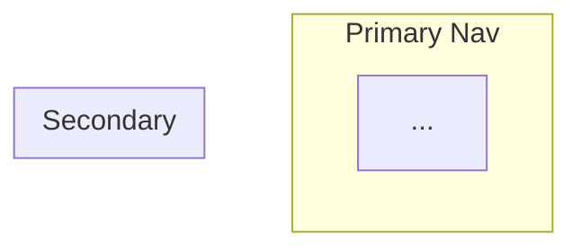

# Content Architecture Blueprint Template

Use this exact structure for `full workshop` output.

````markdown
# [Product Name] -- Content Architecture Blueprint

## Overview
[One paragraph: what this product is, who it serves, the core value proposition]

## Top Tasks
[The 5-10 tasks identified in Phase 1, ordered by importance]

## User Journeys

### Journey: [Name] ([Persona])
- **Entry**: [how they arrive -- Google, direct link, notification, etc.]
- **Path**: [Screen A] -> [action] -> [Screen B] -> [action] -> [Screen C]
- **Goal**: [what they accomplish]
- **Success metric**: [measurable outcome]
- **Friction points**: [potential obstacles at each step]

### Onboarding Journey (app-web / cli-frontend only)
- **Pattern**: [Welcome Survey | Learn-by-Doing | Interactive Checklist | Empty State | Template Pre-loading]
- **Target**: Time-to-Value < 2 minutes, max 3 signup fields
- **Path**: [signup -> routing question -> first value action -> confirmation]

## Sitemap



## Screen Inventory

### [Screen Name]
- **URL**: /path
- **Job**: [one sentence: "This screen [does X] so the user can [Y]"]
- **Priority**: MVP | v2 | nice-to-have
- **Sections** (top to bottom):
  1. **[Section name]** -- [content: real headline, real description, real CTA label] -- [interactions: buttons, links, filters, modals] -- [links to: other screens]
  2. ...
- **Does NOT contain**: [explicitly excluded content to prevent bloat]
- **Linked from**: [screens that link here]

#### States (app-web / cli-frontend only)
- **Empty state**: [what user sees on first use -- describe the message + CTA. Reference: IBM Carbon/PatternFly patterns. Show actionable next step, not decorative illustration]
- **Loading state**: [skeleton screen, not spinner -- 20-30% improvement in perceived speed]
- **Error state**: [what happened + why + what the user can do about it]

#### Content Strategy
- **Voice/tone**: [position on NNGroup's 4 dimensions: Funny<>Serious, Formal<>Casual, Respectful<>Irreverent, Enthusiastic<>Matter-of-fact]
- **Key microcopy**: [button labels, error messages, empty state text -- real words, not placeholders]
- **Content owner**: [who writes and maintains this content]

### [Next Screen]
...

## Navigation

### Primary Navigation
[Ordered list of nav items with target screens. Each label passes the 4S test.]

### Secondary Navigation / Footer
[Items]

### Utility (not in nav)
[Auth screens, error pages, legal, etc.]

## Priority Matrix

| Screen | Priority | Dependencies | Relative effort |
|--------|----------|--------------|-----------------|
| ...    | MVP      | None         | S / M / L       |

## What Disappears (redesign only)
[Start this section by naming the feature parity trap explicitly. Not everything needs to be kept. List verdicts.]

| Former screen | Verdict | Reason | Redirect |
|---------------|---------|--------|----------|
| ...           | Cut     | ...    | 301 -> /new-path |

## Design Rationale
[Name the frameworks and patterns that informed the architecture: navigation sizing, landing-page framework, CLI-first model, Pareto rule, feature parity trap, etc.]

## Cross-Cutting Concerns
[Anything not screen-specific: SEO redirects, accessibility, performance, content to produce, analytics setup, multilingual strategy]
````
