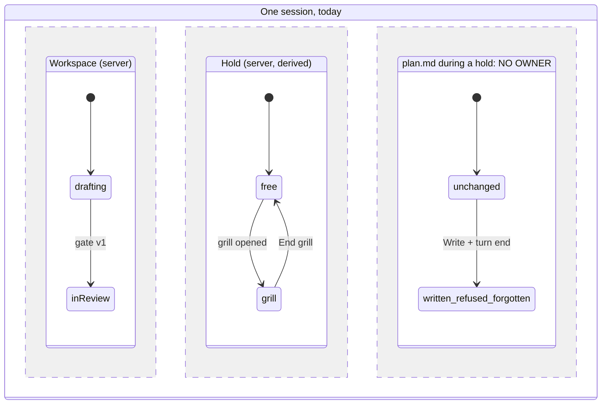

# Inventory, classify, map

Steps 2 to 4 of the audit. The goal is one table that says, for every piece of
state the flow touches, who writes it and who believes it.

## What counts as a piece of state

- A literal union or enum field: `kind: "drafting" | "inReview"`, `status`, `phase`.
- A boolean or nullable slot that gates behavior: `isOpen`, `pending: X | null`.
- Module-scope or closure memory: `let state`, `new Map`, `new WeakMap`, `WeakSet`.
- Anything persisted: files, database rows, a key-value store, `localStorage`.
- A copy of another piece: a UI signal fed by an event stream, a cache, a memo.
- A timer or retry counter whose expiry changes behavior.
- An ordering rule written only in prose: a prompt, a skill, a doc an agent
  follows. It is state the code never checks.

A value computed on each read from other pieces is **derived**: list it, it is
where a forgotten input hides.

## Search recipes

Start from the symptom's strings (the label the UI shows, the error text), then
widen. Adjust the patterns to the stack.

```bash
rg -n '"(drafting|pending|open|closed|running|idle)"'          # the flow's own literals
rg -n 'kind: "|status: "|phase: "|state: "'                      # tagged unions
rg -n 'new (Weak)?(Map|Set)\(|^\s*let \w+ = (null|false|true)'  # memory slots
rg -n 'localStorage|sessionStorage|\.store\.|writeFile|INSERT'   # persistence
rg -n '\.catch\(\(\) =>|catch \{\s*\}|catch \(_'                 # dropped errors
rg -n -i 'never|always|only once|before|after|until' -g '*.md'   # prose rules
```

Delegate this sweep to a read-only subagent when it spans more than a few
files. Prompt shape:

> Read-only, very thorough. For each state machine that decides <the flow>, give
> the file and symbol that owns it, the runtime, the exact state literals, what
> stores them, the transitions (event, from, to, the symbol that performs it),
> and every reader that branches on them. Then replay <the symptom> step by step
> through all of them, and list the combinations the code allows that are
> contradictory or shown nowhere. Cite symbols, not line numbers.

Before using the report, open three of its claims yourself: the one the symptom
rests on, a dropped error, and a reader that ignores an input.

## The inventory table

| Piece | Runtime | Writer | Storage | Lifetime | Readers | Class |
|---|---|---|---|---|---|---|
| `workspace.kind` | server | `gateVersion` | derived from `.review/` | disk | 17 files | derived |
| `step.pending` | server | `POST propose` | `WeakMap` | process | page window | volatile |

## Classes

| Class | Meaning | Question it raises |
|---|---|---|
| source | the one place the fact is written | is it the only writer? |
| derived | recomputed from sources on read | does it read every input it should? |
| copy | a replica of a source in another runtime | on which event is it refreshed, and is that the source's event? |
| volatile | in memory only | what does a restart show the other runtimes? |
| prose | a rule only a reader of text enforces | what happens when the model or person does not follow it? |

## Red flags

- A fact with no owner: something that happened and nothing records it (a
  refused write, a file changed while held). Draw it as its own region.
- A fact with two writers.
- A copy refreshed on another event than its source.
- A derived value that ignores an input its siblings read.
- An error turned into silence: `.catch(() => …)`, an empty `catch`.
- An ordering rule that exists only in prose.
- Two symptom fixes on the same flow in the history: `git log -S '<literal>'`.

## The map

Draw the pieces as parallel regions of one statechart, so the reader sees that
nothing ties them together. Mermaid:



Then replay the symptom as a `sequenceDiagram` across the runtimes, one arrow
per real call, with a `Note` where a fact is lost. List every combination of
regions the code allows that the UI or the logic does not represent: that list
is the input of the invariants.
