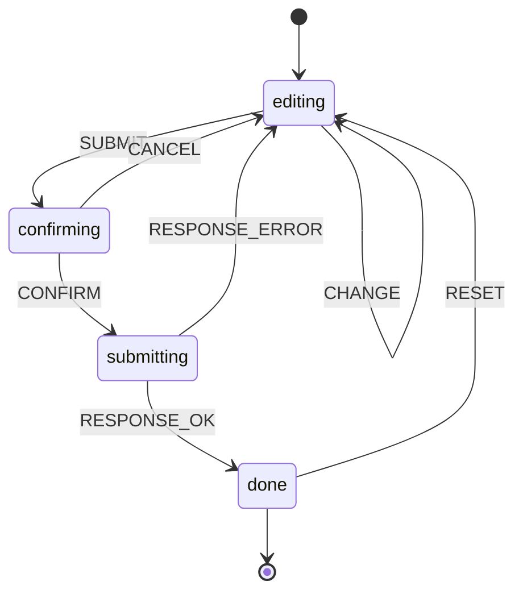
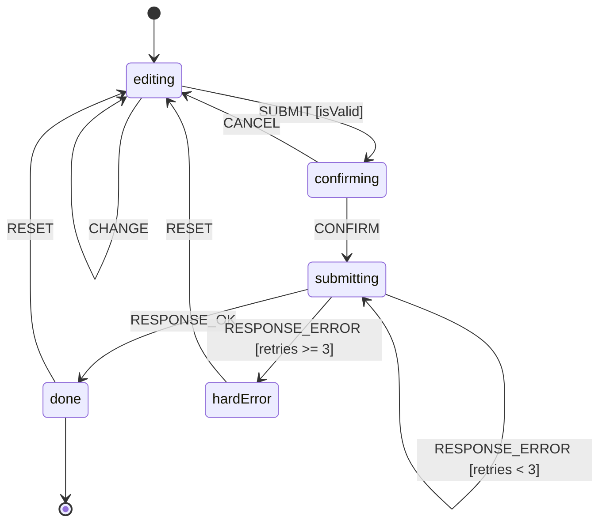

# Modeling process: a worked example

Walk through the 7-step checklist from `SKILL.md` on a real example: a
**submit-with-confirmation** form. The user fills the form, hits submit, sees
a confirmation dialog, then either confirms (the request fires) or cancels
(returns to editing).

## Step 1: Enumerate states (happy path first)

```text
editing -> confirming -> submitting -> done
```

Four states. The happy path goes left to right.

## Step 2: Enumerate events

| Event | Source |
|---|---|
| `CHANGE` | User types in a field |
| `SUBMIT` | User clicks the submit button |
| `CONFIRM` | User clicks confirm in the dialog |
| `CANCEL` | User clicks cancel in the dialog |
| `RESPONSE_OK` | Server responds 2xx |
| `RESPONSE_ERROR` | Server responds 4xx / 5xx, or network fails |
| `RESET` | User clicks "submit another" after done |

## Step 3: Draw transitions



Every state has at least one outgoing transition. No dead ends.

## Step 4: List impossible state combinations

If we had modeled this with booleans (`isEditing`, `isConfirming`,
`isSubmitting`, `isDone`) we would have `2^4 = 16` combinations. Of those:

- 1 valid combination per real state (4 valid)
- 1 "all false" garbage combination
- 11 multi-true garbage combinations (`isEditing && isSubmitting`, etc.)

With our 4-state machine, the type system has exactly 4 states. The other
12 combinations are unrepresentable.

## Step 5: Add guards

Two refinements:

- `SUBMIT` should only move to `confirming` if the form is valid.
- `RESPONSE_ERROR` should retry up to 3 times before going back to `editing`,
  otherwise show a hard error state.



## Step 6: Define entry / exit actions

| State | Entry | Exit |
|---|---|---|
| `editing` | (none) | (none) |
| `confirming` | Show confirmation modal, focus "confirm" button | Hide modal |
| `submitting` | Send `POST /submit`, start timeout | Clear timeout |
| `hardError` | Show non-retryable submit error | (none) |
| `done` | Reset `retries` to 0, show success toast | (none) |

Transition actions:

- On `RESET`: clear form data.

## Step 7: Sketch and review

The diagram in step 5 is the spec. Show it to a teammate before coding.
Common sources of feedback at this stage:

- "What if the user closes the modal by clicking outside?" (Add a `DISMISS`
  event mapped to `CANCEL`.)
- "What if the network is offline before submit?" (Either guard `SUBMIT` on
  `isOnline`, or model an `offline` parallel region.)
- "What if the server takes 30s?" (Add a `TIMEOUT` event from `submitting`
  back to `editing` with a "request timed out" message.)

Each piece of feedback either tightens a guard, adds an event, or splits a
state. The diagram surfaces these questions earlier than code would.

## Final code (TypeScript discriminated union)

The corresponding minimal TypeScript implementation. See
`implementations/typescript-discriminated-unions.md` for the explanation.

```typescript
type FormValues = Record<string, string>;
type ValidationErrors = Record<string, string>;
type SubmitError = Error;
type SubmitResult = { id: string };

type State =
  | { status: "editing"; data: FormValues; errors: ValidationErrors }
  | { status: "confirming"; data: FormValues }
  | { status: "submitting"; data: FormValues; retries: number }
  | { status: "hardError"; data: FormValues; error: SubmitError }
  | { status: "done"; result: SubmitResult };

type MachineEvent =
  | { type: "CHANGE"; field: string; value: string }
  | { type: "SUBMIT" }
  | { type: "CONFIRM" }
  | { type: "CANCEL" }
  | { type: "RESPONSE_OK"; result: SubmitResult }
  | { type: "RESPONSE_ERROR"; error: SubmitError }
  | { type: "RESET" };

const MAX_RETRIES = 3;

declare function validate(data: FormValues): ValidationErrors;
declare function emptyFormValues(): FormValues;

function reduce(state: State, event: MachineEvent): State {
  switch (state.status) {
    case "editing":
      if (event.type === "CHANGE") {
        const data = { ...state.data, [event.field]: event.value };
        return { status: "editing", data, errors: validate(data) };
      }
      if (event.type === "SUBMIT" && Object.keys(state.errors).length === 0) {
        return { status: "confirming", data: state.data };
      }
      return state;

    case "confirming":
      if (event.type === "CONFIRM") {
        return { status: "submitting", data: state.data, retries: 0 };
      }
      if (event.type === "CANCEL") {
        return { status: "editing", data: state.data, errors: {} };
      }
      return state;

    case "submitting":
      if (event.type === "RESPONSE_OK") {
        return { status: "done", result: event.result };
      }
      if (event.type === "RESPONSE_ERROR") {
        if (state.retries + 1 < MAX_RETRIES) {
          return {
            status: "submitting",
            data: state.data,
            retries: state.retries + 1,
          };
        }
        return { status: "hardError", data: state.data, error: event.error };
      }
      return state;

    case "hardError":
      if (event.type === "RESET") {
        return { status: "editing", data: state.data, errors: {} };
      }
      return state;

    case "done":
      if (event.type === "RESET") {
        return { status: "editing", data: emptyFormValues(), errors: {} };
      }
      return state;
  }
}
```

The implementation keeps every transition explicit and lets the compiler
enforce exhaustiveness.

## Take-aways

1. Draw before you code. Many design bugs are visible in the diagram.
2. Start with the happy path. Add error and edge transitions one by one.
3. Use guards for instant conditions, states for persistent modes.
4. Every state needs an exit. If not, the user is stuck.
5. The diagram is the source of truth. Keep it next to the code.

## Sources

- [statecharts.dev: how to use statecharts](https://statecharts.dev/how-to-use-statecharts.html)
- David Harel, *Statecharts*, 1987 ([PDF](https://www.state-machine.com/doc/Harel87.pdf)), section 2 (the Citizen watch worked example)
- [Stately Studio examples](https://stately.ai/registry/discover)
