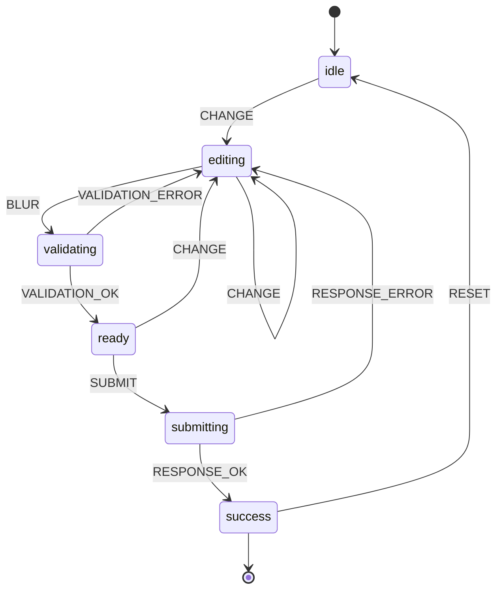
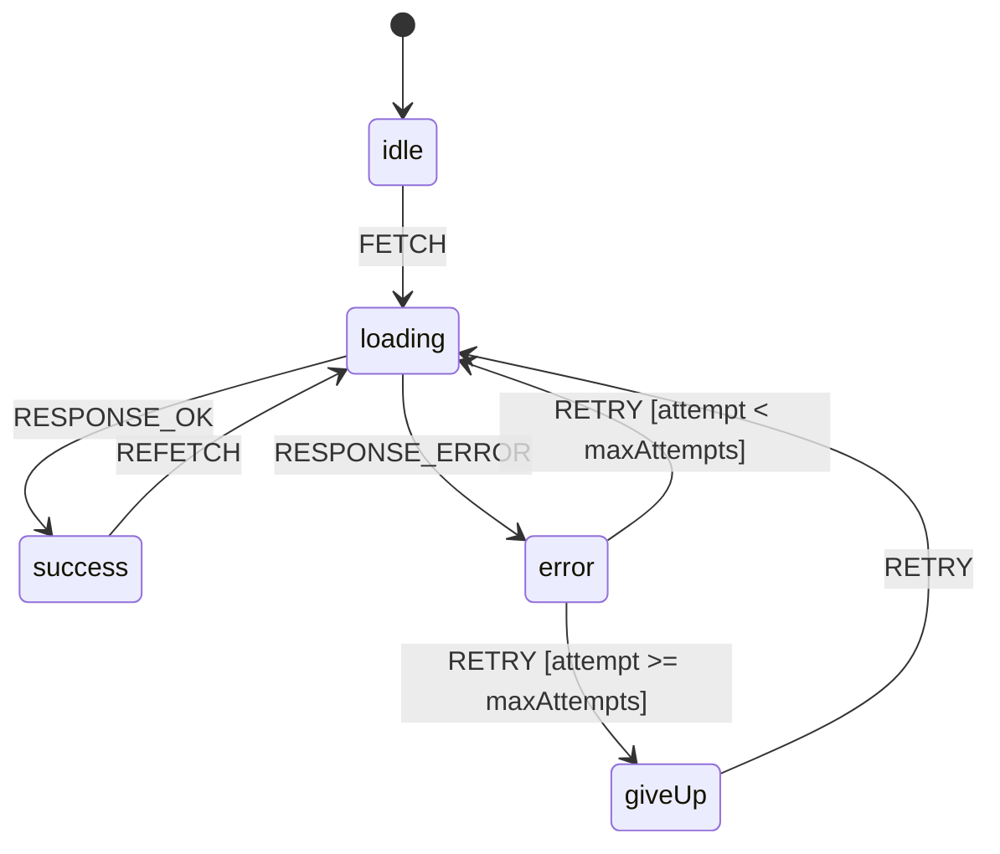
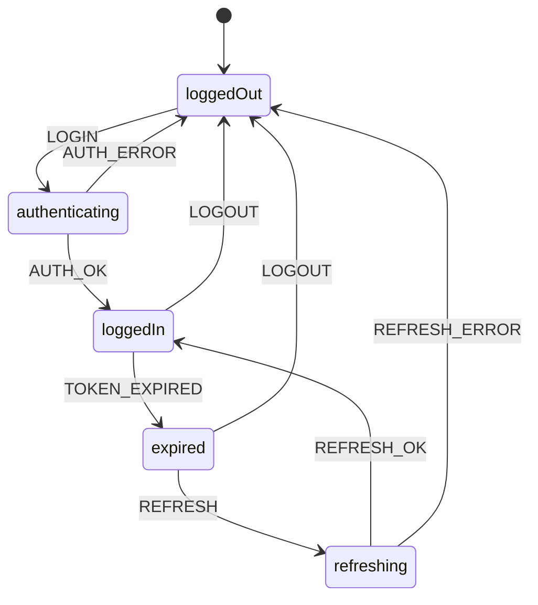
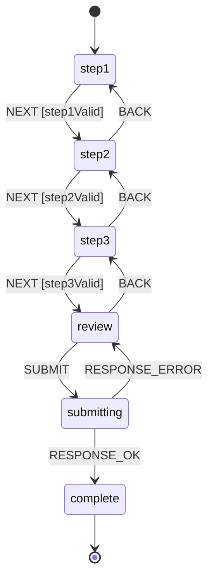
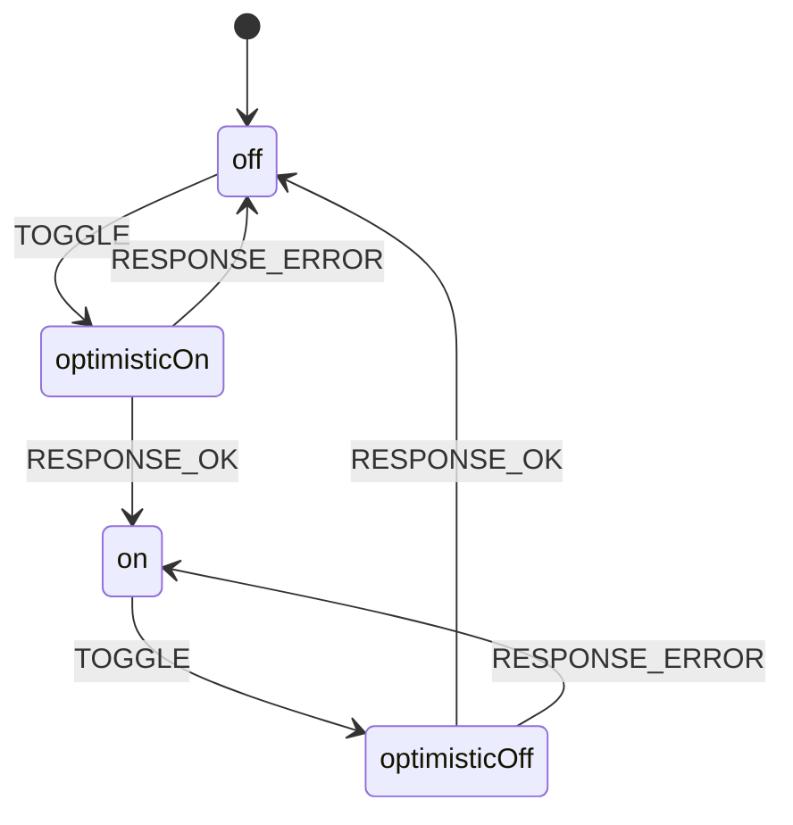
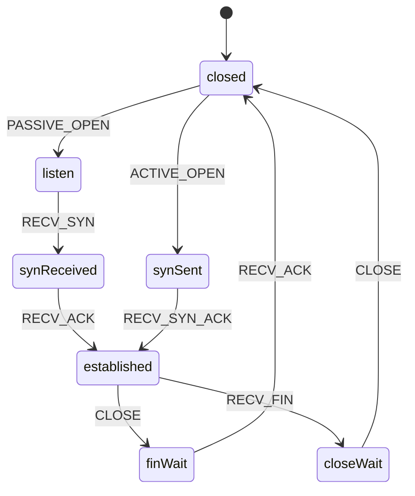

# Common patterns

Each pattern: short rationale, Mermaid diagram, and a TypeScript or C
implementation sketch. Data fetching includes a complete reducer and an
XState v5 sketch.

## 1. Form

### Diagram



### TypeScript

```typescript
type State =
  | { status: "idle" }
  | { status: "editing"; data: FormValues; errors: ValidationErrors }
  | { status: "validating"; data: FormValues }
  | { status: "ready"; data: FormValues }
  | { status: "submitting"; data: FormValues }
  | { status: "success"; result: SubmitResult };

type MachineEvent =
  | { type: "CHANGE"; field: string; value: string }
  | { type: "BLUR" }
  | { type: "VALIDATION_OK" }
  | { type: "VALIDATION_ERROR"; errors: ValidationErrors }
  | { type: "SUBMIT" }
  | { type: "RESPONSE_OK"; result: SubmitResult }
  | { type: "RESPONSE_ERROR" }
  | { type: "RESET" };
```

`validating` exists as its own state (rather than a guard) because it has a
visible UI (spinner on the field) and a duration (async validation). Compare
with: a synchronous `isValid` guard would not need a state.

## 2. Data fetching with retry

### Diagram



### TypeScript

```typescript
type State =
  | { status: "idle" }
  | { status: "loading"; attempt: number }
  | { status: "success"; data: T }
  | { status: "error"; error: Error; attempt: number }
  | { status: "giveUp"; lastError: Error };

const MAX_ATTEMPTS = 3;

function reduce(state: State, event: MachineEvent): State {
  switch (state.status) {
    case "idle":
      if (event.type === "FETCH") return { status: "loading", attempt: 1 };
      return state;
    case "loading":
      if (event.type === "RESPONSE_OK") return { status: "success", data: event.data };
      if (event.type === "RESPONSE_ERROR")
        return { status: "error", error: event.error, attempt: state.attempt };
      return state;
    case "error":
      if (event.type === "RETRY") {
        return state.attempt < MAX_ATTEMPTS
          ? { status: "loading", attempt: state.attempt + 1 }
          : { status: "giveUp", lastError: state.error };
      }
      return state;
    case "success":
      if (event.type === "REFETCH") return { status: "loading", attempt: 1 };
      return state;
    case "giveUp":
      if (event.type === "RETRY") return { status: "loading", attempt: 1 };
      return state;
  }
}
```

### XState v5

```typescript
import { setup, assign, fromPromise } from "xstate";

const fetchMachine = setup({
  types: {
    context: {} as { data: T | null; error: Error | null; attempt: number },
    events: {} as { type: "FETCH" } | { type: "RETRY" } | { type: "REFETCH" },
  },
  actors: {
    fetcher: fromPromise<T>(async () => {
      const r = await fetch("/api");
      if (!r.ok) throw new Error("HTTP " + r.status);
      return r.json();
    }),
  },
  guards: {
    canRetry: ({ context }) => context.attempt < 3,
  },
}).createMachine({
  id: "fetch",
  initial: "idle",
  context: { data: null, error: null, attempt: 0 },
  states: {
    idle:    { on: { FETCH: { target: "loading" } } },
    loading: {
      entry: assign({ attempt: ({ context }) => context.attempt + 1 }),
      invoke: {
        src: "fetcher",
        onDone:  { target: "success", actions: assign({ data: ({ event }) => event.output }) },
        onError: { target: "error",   actions: assign({ error: ({ event }) => event.error as Error }) },
      },
    },
    success: { on: { REFETCH: { target: "loading" } } },
    error:   {
      on: {
        RETRY: [
          { target: "loading", guard: "canRetry" },
          { target: "giveUp" },
        ],
      },
    },
    giveUp:  {
      entry: assign({ attempt: 0 }),
      on: { RETRY: { target: "loading" } },
    },
  },
});
```

## 3. Authentication

### Diagram



### TypeScript

```typescript
type State =
  | { status: "loggedOut" }
  | { status: "authenticating"; credentials: Credentials }
  | { status: "loggedIn"; user: User; token: Token }
  | { status: "expired"; user: User }
  | { status: "refreshing"; user: User };
```

The `expired` state matters: it lets the UI keep showing the user data
(name, avatar) while refresh is in flight, instead of bouncing back to the
login screen.

## 4. Multi-step wizard

### Diagram



### TypeScript

```typescript
type State =
  | { status: "step1"; data: Partial<FormValues> }
  | { status: "step2"; data: Partial<FormValues> }
  | { status: "step3"; data: Partial<FormValues> }
  | { status: "review"; data: FormValues }
  | { status: "submitting"; data: FormValues }
  | { status: "complete"; result: SubmitResult };
```

Note the `data` type narrows from `Partial<FormValues>` (steps in progress)
to `FormValues` (review onwards). This is exactly the kind of invariant that
discriminated unions encode for free.

## 5. Toggle with optimistic UI

### Diagram



### TypeScript

```typescript
type State =
  | { status: "off" }
  | { status: "optimisticOn"; pendingRequest: AbortController }
  | { status: "on" }
  | { status: "optimisticOff"; pendingRequest: AbortController };
```

The `optimistic*` states render the new value but expose the in-flight
controller so the user can cancel. On error the state rolls back.

## 6. Network protocol handshake (TCP-style)

A simplified TCP-style three-way handshake. Useful as a reference for any
protocol with active and passive open sequences.

### Diagram



### C (transition-table form)

```c
#include <stdbool.h>
#include <stddef.h>

typedef enum {
    CLOSED, LISTEN, SYN_SENT, SYN_RECEIVED, ESTABLISHED, FIN_WAIT, CLOSE_WAIT,
    STATE_COUNT
} State;

typedef enum {
    ACTIVE_OPEN, PASSIVE_OPEN, RECV_SYN, RECV_SYN_ACK, RECV_ACK,
    CLOSE, RECV_FIN,
    EVENT_COUNT
} Event;

typedef struct { bool valid; State next; void (*action)(void); } Transition;

static void send_syn(void);
static void send_syn_ack(void);
static void send_ack(void);
static void send_fin(void);

static const Transition tcp_table[STATE_COUNT][EVENT_COUNT] = {
    [CLOSED] = {
        [ACTIVE_OPEN]  = { true, SYN_SENT,    send_syn },
        [PASSIVE_OPEN] = { true, LISTEN,      NULL },
    },
    [LISTEN] = {
        [RECV_SYN]     = { true, SYN_RECEIVED, send_syn_ack },
    },
    [SYN_SENT] = {
        [RECV_SYN_ACK] = { true, ESTABLISHED, send_ack },
    },
    [SYN_RECEIVED] = {
        [RECV_ACK]     = { true, ESTABLISHED, NULL },
    },
    [ESTABLISHED] = {
        [CLOSE]        = { true, FIN_WAIT,    send_fin },
        [RECV_FIN]     = { true, CLOSE_WAIT,  send_ack },
    },
    [FIN_WAIT] = {
        [RECV_ACK]     = { true, CLOSED,      NULL },
    },
    [CLOSE_WAIT] = {
        [CLOSE]        = { true, CLOSED,      send_fin },
    },
};

static State current = CLOSED;

void handle_event(Event e) {
    if ((int)current < 0 || current >= STATE_COUNT ||
        (int)e < 0 || e >= EVENT_COUNT) {
        return;
    }

    Transition t = tcp_table[current][e];
    if (!t.valid) return;
    if (t.action) t.action();
    current = t.next;
}

static void send_syn(void) {}
static void send_syn_ack(void) {}
static void send_ack(void) {}
static void send_fin(void) {}
```

The TCP RFC ([RFC 9293](https://datatracker.ietf.org/doc/html/rfc9293))
describes the full state machine. The `tcp_table` form makes it auditable
against the RFC at a glance.

## Sources

- [XState by Example (gallery)](https://xstatebyexample.com/)
- David Khourshid, [*Crafting Stateful Styles with State Machines*](https://www.youtube.com/watch?v=0cqeGeC98MA) (toggle / optimistic UI patterns)
- [RFC 9293: Transmission Control Protocol](https://datatracker.ietf.org/doc/html/rfc9293) (TCP state diagram, section 3.3.2)
- [stately.ai/registry](https://stately.ai/registry/discover) (community gallery of XState machines)
- [Stately.ai docs: actors and async](https://stately.ai/docs/actors)
