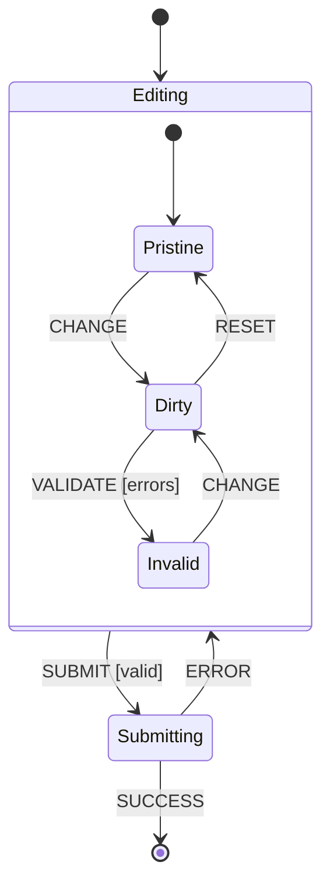
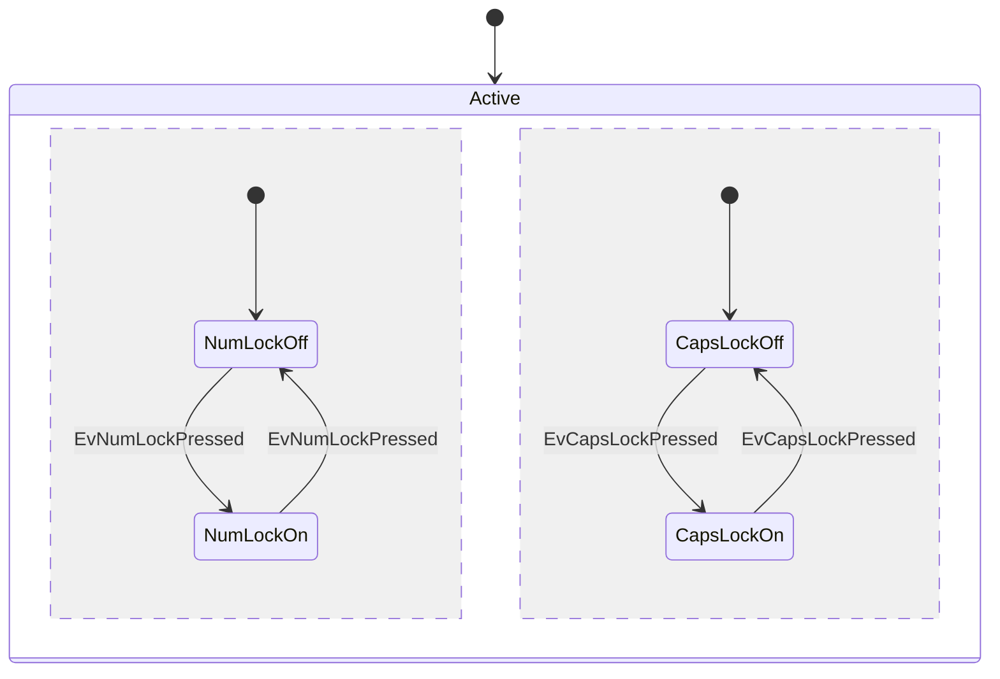

# Statecharts: extensions over flat FSMs

A flat FSM enumerates one node per `(feature1, feature2, feature3, ...)`
combination. With `n` independent boolean features that produces `2^n` states.
This is **state explosion** and it is why naive FSMs fall apart on real UIs and
real protocols.

David Harel's 1987 paper *Statecharts: A Visual Formalism for Complex Systems*
([PDF](https://www.state-machine.com/doc/Harel87.pdf)) introduced three
extensions that fix this: **hierarchy**, **concurrency** (parallel regions),
and **history**. Together with guards, they keep diagrams linear in the
number of features instead of exponential.

## State explosion: the canonical example

From [statecharts.dev/state-machine-state-explosion](https://statecharts.dev/state-machine-state-explosion.html):

A field validation widget starts with two states:

```text
valid <-> invalid          # 2 states, 2 transitions
```

Add an `enabled` / `disabled` dimension:

```text
valid+enabled, valid+disabled, invalid+enabled, invalid+disabled
                                                  # 4 states, 8 transitions
```

Add a `changed` / `unchanged` dimension:

```text
8 states, 12+ transitions
```

Each new boolean dimension multiplies the state count. A real form has 5+
dimensions. Flat FSMs are not viable.

## Fix 1: Hierarchy (compound states)

Group related states under a parent. The parent's transitions apply to all
substates. The substates only need to model the part that actually varies.



`SUBMIT` is defined once on the parent, not duplicated on every substate. If
the form is submitted from `Pristine`, `Dirty`, or `Invalid`, the same
transition fires (subject to the guard).

statecharts.dev definition: *"A state that has one or more substates."*
([compound-state](https://statecharts.dev/glossary/compound-state.html))

## Fix 2: Parallel (orthogonal) regions

Two orthogonal dimensions get their own regions inside the same compound
state. Both regions are active at once. The possible runtime configurations
are still product-shaped, but the diagram and transition definitions are
written as separate regions instead of one flat product.



A flat FSM modelling NumLock x CapsLock x ScrollLock would need `2^3 = 8`
combined states in one transition graph. With three regions, you draw three
2-state regions and let the statechart runtime compose the active
configuration.

statecharts.dev definition: *"A compound state where multiple separate state
machines all get to be active at the same time."*
([parallel-state](https://statecharts.dev/glossary/parallel-state.html))

## Fix 3: History pseudostates

When you re-enter a compound state, you usually want to resume where you
left off, not restart from the initial substate. A history pseudostate
remembers the last active substate.

- **Shallow history** (`H`): remembers the last active *direct* substate.
- **Deep history** (`H*`): remembers the last active *leaf* state across
  arbitrarily nested compounds.

UML notation:

```text
state Player {
    [*] --> Stopped
    state H
    Stopped --> Playing : PLAY
    Playing --> Paused : PAUSE
    Paused --> Playing : PLAY

    Player --> Off : POWER_OFF
}
Off --> Player.H : POWER_ON      # resumes Stopped, Playing, or Paused
```

(Mermaid `stateDiagram-v2` does not render history pseudostates today.
Use PlantUML or document as a note.)

statecharts.dev definition: *"A pseudo-state that remembers the most recent
sibling states that were active."*
([history-state](https://statecharts.dev/glossary/history-state.html))

## Fix 4: Guards (already in the 5 components)

Guards subsume some patterns that would otherwise need extra states. Instead
of two states `cart-empty` and `cart-non-empty` with separate transitions,
one transition with `[cart.size > 0]` works.

Use guards sparingly. If a guard captures a *persistent* condition (the
machine returns to the same logical mode whenever it is true), promote it
to a state. Guards are best for *event-instant* conditions.

## When you need statecharts vs a flat FSM

Flat FSM is enough when:

- The complete transition set still fits in one readable table or reducer
- No two dimensions vary independently
- No "resume where I left off" requirement

Reach for statecharts when:

- A flat design makes the transition set hard to audit
- Two or more dimensions are independent (NumLock x CapsLock; connected x
  recording; authenticated x menu-open)
- A user can interrupt a flow and resume it later (modal, wizard with
  navigation)

In TypeScript / JavaScript, start with a discriminated union while the machine
stays flat and readable. When hierarchy, parallel regions, or history enter the
model, reach for [XState v5](./implementations/xstate.md). In C, see [Samek's
QP framework](https://www.state-machine.com/). In Rust, see
[statig](./implementations/rust.md).

## Sources

- David Harel, *Statecharts: A Visual Formalism for Complex Systems*,
  Science of Computer Programming 8, 1987 ([PDF](https://www.state-machine.com/doc/Harel87.pdf))
- [statecharts.dev: state explosion](https://statecharts.dev/state-machine-state-explosion.html)
- [statecharts.dev: compound state](https://statecharts.dev/glossary/compound-state.html)
- [statecharts.dev: parallel state](https://statecharts.dev/glossary/parallel-state.html)
- [statecharts.dev: history state](https://statecharts.dev/glossary/history-state.html)
- [W3C SCXML 1.0](https://www.w3.org/TR/scxml/) (defines the semantics formally)
- Miro Samek, *Practical UML Statecharts in C/C++*, 2nd ed.,
  [book](https://www.state-machine.com/psicc2), chapter 2
