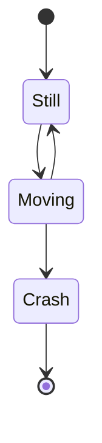
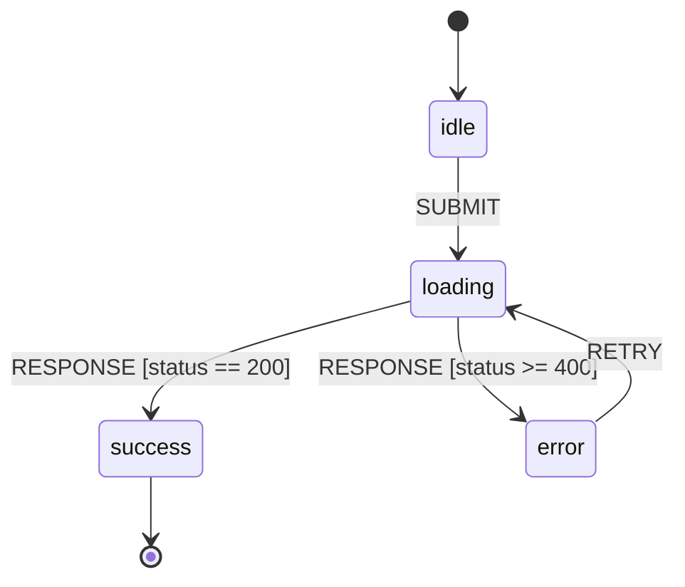
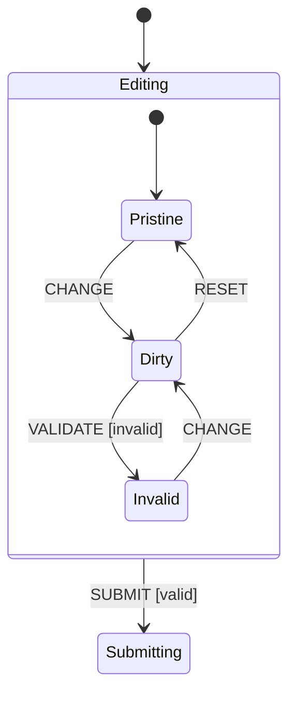
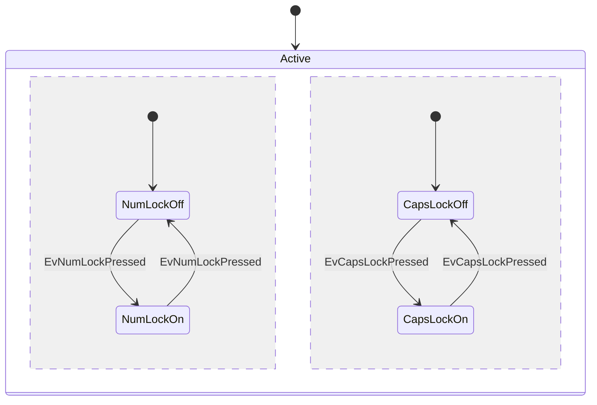
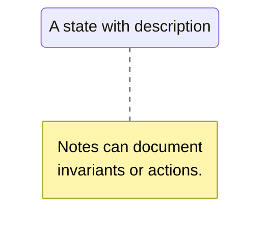

# Visual notation cheat sheet

Use Mermaid `stateDiagram-v2` for code-checked-in diagrams. Use UML for
specifications. Use [stately.ai/inspect](https://stately.ai/docs/inspector)
for live debugging of XState machines.

## Mermaid `stateDiagram-v2`

Render at [mermaid.live](https://mermaid.live/) or in any platform that
supports Mermaid (GitHub, Obsidian, Astro Starlight, MkDocs).

### Basic states and transitions

`[*]` is the initial / final pseudostate.

### Transition with event label and guard

The label after `:` is `EVENT [guard] / action`. Mermaid is permissive about
the syntax: the engine treats it as free text.

### Composite (hierarchical) state

Substates inherit transitions from their parent. The composite state is
exited only when an outgoing transition from the parent fires (or from a
substate that targets outside).

### Parallel (concurrent / orthogonal) regions

The `--` separator inside a `state X { ... }` block declares an orthogonal
region. Both regions are active when the parent is active.

### Notes

### Limits

Mermaid `stateDiagram-v2` supports composite states, parallel regions,
choice, fork and join. It still does not render UML history pseudostates
(`H`, `H*`) with full UML semantics. For history-heavy specs or safety
review, use PlantUML or UML tooling and document renderer support in the
repo.

## UML state diagram conventions

Standard symbols, in order of how often they appear:

| Symbol | Meaning |
|---|---|
| Filled black circle | Initial pseudostate (entry point of a region) |
| Filled black circle in a ring | Final state (region completes when entered) |
| Rounded rectangle | State (atomic or compound) |
| Arrow | Transition. Label: `event [guard] / action` |
| Circle with `H` | Shallow history pseudostate (last active substate) |
| Circle with `H*` | Deep history pseudostate (last active leaf, recursively) |
| Diamond | Choice / junction pseudostate (conditional routing) |
| Black bar | Fork (one source, multiple targets in parallel regions) or join |

## Tooling

| Tool | Use |
|---|---|
| [mermaid.live](https://mermaid.live/) | Quick Mermaid rendering, exportable |
| [Stately Studio](https://stately.ai/studio) | Visual XState editor, generates code |
| [Stately Inspector](https://stately.ai/docs/inspector) | Live debug of running XState actors |
| [PlantUML state diagrams](https://plantuml.com/state-diagram) | Full UML, supports history and fork/join |
| [QM (Quantum Modeler)](https://www.state-machine.com/products/qm/) | Samek's modeler, generates production C/C++ |
| [SCION](https://gitlab.com/scion-scxml/scion) | SCXML interpreter for the browser |

## Choosing a notation

- **Inline docs / READMEs**: Mermaid `stateDiagram-v2` (no install, GitHub renders it).
- **Specification documents**: PlantUML or UML in a design tool. Covers history, forks, joins, regions.
- **Code generation pipeline**: SCXML (W3C standard) or XState's TypeScript machine literal.
- **Embedded / safety-critical**: Samek's QM tool, generates audited C from the diagram.

## Sources

- [Mermaid stateDiagram-v2 docs](https://mermaid.js.org/syntax/stateDiagram.html)
- [PlantUML state diagram docs](https://plantuml.com/state-diagram)
- [Stately Studio](https://stately.ai/studio)
- [W3C SCXML 1.0 Recommendation](https://www.w3.org/TR/scxml/)
- [QM Modeler (Quantum Leaps)](https://www.state-machine.com/products/qm/)
